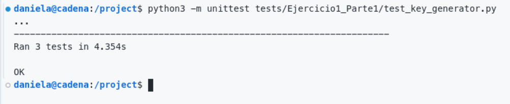

# Practica Calificada 3
## Guía para Usar el Dev Container

### 1. **Subir el código al repositorio de GitHub**

Deben de estar todos los archivos necesarios, incluyendo los del Dev Container (`.devcontainer/Dockerfile` y `.devcontainer/devcontainer.json`), subidos al repositorio de GitHub. La estructura del proyecto es la siguiente

```
/PC3/
│
├── .devcontainer/
│   ├── Dockerfile
│   └── devcontainer.json
│
|-- src
|   |-- ejercicio1-parte1/
|   `-- ejercicio1-parte2/
`-- tests
    |-- ejercicio1-parte1/
    `-- ejercicio1-parte2/
├── requirements.txt    # Dependencias de Python o de otro entorno
|-- README.md
|-- requirements.txt
```

- **Dockerfile**: Define cómo se construye la imagen del contenedor.
- **devcontainer.json**: Configura el contenedor, incluyendo extensiones de VSCode, puertos, comandos a ejecutar, entre otros.

Esto permite que cualquier persona que clone el repositorio tenga acceso al mismo entorno de desarrollo, sin necesidad de configurar manualmente el entorno.

---

### 2. **Instrucciones para clonar y ejecutar el contenedor**

#### Paso 1: **Clonar el repositorio desde GitHub**
Se debe clonar el repositorio:

```bash
git clone https://github.com/danicade24/Practica-Calificada-3.git
```

#### Paso 2: **Asegurarse de tener Docker y VS Code instalados**
Es necesario tener instalados:

- **Docker**: [Descargar Docker](https://www.docker.com/get-started)
- **Visual Studio Code**: [Descargar VS Code](https://code.visualstudio.com/)
- **Extensión Remote - Containers** de VS Code: Se puede instalar desde la tienda de extensiones de VS Code.

#### Paso 3: **Abrir el proyecto en VS Code y ejecutar el contenedor**
Una vez clonado el repositorio y con las herramientas listas, se deben seguir estos pasos:

1. **Abrir VS Code** y navegar a la carpeta del proyecto clonado.
2. **Abrir el contenedor** en VS Code:
   - Abre la Paleta de Comandos (`Ctrl+Shift+P`).
   - Selecciona `Remote-Containers: Reopen in Container`. 
   - VS Code detectará automáticamente los archivos `.devcontainer` y configurará el entorno.

**Nota**: Si es que no quieres usar VS Code, también puedes ejecutar el contenedor desde tu terminal, pero VS Code simplifica mucho el proceso.


---

### 3. **Uso del contenedor sin VS Code (Solo Docker)**

Si alguien no quiere usar VS Code, también puede trabajar solo con Docker. Los pasos son los siguientes:

#### Paso 1: **Clonar el repositorio**

```bash
git clone https://github.com/danicade24/Practica-Calificada-3.git
```

#### Paso 2: **Construir la imagen Docker**

Construir la imagen del contenedor usando el Dockerfile:

```bash
docker build -t project .
```

#### Paso 3: **Ejecutar el contenedor**

Ejecutar el contenedor:

```bash
docker run -it --name pc3 -v $(pwd):/workspace project
```

Esto abre una terminal interactiva dentro del contenedor. Desde allí, puedes ejecutar la aplicación y cualquier comando necesario.

#### Paso 4: **Ejecutar la aplicación**

Dentro del contenedor, puedes instalar dependencias y ejecutar la aplicación, tal como lo harías en tu entorno local.

---

## Parte 1: Ejercicio 1

### Objetivo 1: Generación de Claves
Este objetivo se centra en implementar la generación de claves RSA, asegurando que el tamaño de las claves sea configurable(1024 o 2048) y que el diseño permita la flexibilidad de cambiar el algoritmo sin modificar el código existente (siguiendo el principio Abierto/Cerrado de SOLID).

### 1.1 Crear una clase responsable de generar pares de claves RSA

```python
from Crypto.PublicKey import RSA

class KeyGenerator:
    def __init__(self, key_size: int):
        """Inicializa el generador con el tamaño de clave especificado 
        key_size: El tamaño de la clave puede ser ajustado a 1024 o 2048"""
        self.key_size = key_size

    def generate_keys(self):
        """Genera y devuelve un par de clave RSA"""
        key = RSA.generate(self.key_size)
        return key, key.publickey()
    
    def serialize_private_key(self, private_key):
        """Serializa la clave privada"""
        return private_key.export_key()
    
    def serialize_public_key(self, public_key):
        """Serializa la clave pública """
        return public_key.export_key()
```
### 1.1 Escribimos algunas pruebas unitarias para esa clase:

```python

import unittest
from src.Ejercicio1_Parte1.key_generator import KeyGenerator

class TestKeyGenerator(unittest.TestCase):

    def setUp(self):
        # Creamos una instancia de KeyGenerator con el tamaño de clave predeterminado (2048 bits)
        self.key_generator = KeyGenerator(key_size=2048)

    def test_generate_keys(self):
        # Generar claves y verificar que se crean correctamente
        private_key, public_key = self.key_generator.generate_keys()
        
        # Comprobamos que las claves no están None
        self.assertIsNotNone(private_key, "La clave privada no debería ser None")
        self.assertIsNotNone(public_key, "La clave pública no debería ser None")

        # Comprobamos que las claves son del tipo esperado 
        self.assertEqual(private_key.size_in_bits(), 2048)
        self.assertEqual(public_key.size_in_bits(), 2048)

    def test_serialize_private_key(self):
        # Generar clave privada y serializarla
        private_key, _ = self.key_generator.generate_keys()
        serialized_private_key = self.key_generator.serialize_private_key(private_key)
        
        # Comprobamos que la clave privada serializada no es None y es  bytes
        self.assertIsNotNone(serialized_private_key)
        self.assertIsInstance(serialized_private_key, bytes)

    def test_serialize_public_key(self):
        # Generar clave pública y serializarla
        _, public_key = self.key_generator.generate_keys()
        serialized_public_key = self.key_generator.serialize_public_key(public_key)
        
        # Comprobamos que la clave pública serializada no es None y es bytes
        self.assertIsNotNone(serialized_public_key)
        self.assertIsInstance(serialized_public_key, bytes)

if __name__ == '__main__':
    unittest.main()
```

Ejecutamos las pruebas  con 
```bash
python3 -m unittest tests/Ejercicio1_Parte1/test_key_generator.py
```
y observamos que todas pasan.




Para ver la cobertura ejecutamos:
```bash
python3 -m pytest --cov=src tests/Ejercicio1_Parte1
```

Nos debe salir algo asi:

```bash
daniela@cadena:/project$ python3 -m pytest --cov=src tests/Ejercicio1_Parte1
============================================================================= test session starts =============================================================================
platform linux -- Python 3.10.12, pytest-8.3.3, pluggy-1.5.0
rootdir: /project
plugins: cov-6.0.0, requests-mock-1.12.1
collected 3 items                                                                                                                                                             

tests/Ejercicio1_Parte1/test_key_generator.py ...                                                                                                                       [100%]

---------- coverage: platform linux, python 3.10.12-final-0 ----------
Name                                     Stmts   Miss  Cover
------------------------------------------------------------
src/Ejercicio1_Parte1/__init__.py            0      0   100%
src/Ejercicio1_Parte1/key_generator.py      11      0   100%
src/Ejercicio1_Parte2/__init__.py            0      0   100%
src/__init__.py                              0      0   100%
------------------------------------------------------------
TOTAL                                       11      0   100%


============================================================================== 3 passed in 3.29s ==============================================================================
```

### Objetivo 2: Cifrado y Descifrado

Este objetivo implica crear métodos para cifrar y descifrar mensajes de texto utilizando las claves generadas.

#### 2.1 Implementar Métodos de Cifrado y Descifrado

Creamos una clase llamada `RSAEncryptor` con métodos para cifrar y descifrar utilizando claves RSA. Esta clase puede ser independiente de `KeyGenerator` para seguir el principio de responsabilidad única.

```python
from Crypto.Cipher import PKCS1_OAEP
from Crypto.PublicKey import RSA
import hashlib

class RSACipher:
    def __init__(self, public_key: RSA.RsaKey, private_key: RSA.RsaKey):
        self.public_key = public_key
        self.private_key = private_key

    def encrypt(self, message: str) -> bytes:
        """Cifra un mensaje de texto plano utilizando la clave pública"""
        # Validar la longitud del mensaje antes de cifrar
        self._validate_message_length(message)
        
        try:
            cipher = PKCS1_OAEP.new(self.public_key)
            encrypted_message = cipher.encrypt(message.encode())
            return encrypted_message
        except Exception as e:
            raise Exception(f"Error durante el cifrado: {e}")

    def decrypt(self, encrypted_message: bytes) -> str:
        """Descifra un mensaje cifrado utilizando la clave privada"""
        try:
            cipher = PKCS1_OAEP.new(self.private_key)
            decrypted_message = cipher.decrypt(encrypted_message)
            return decrypted_message.decode()
        except Exception as e:
            raise Exception(f"Error durante el descifrado: {e}")

    def _validate_message_length(self, message: str):
        max_length = self.get_max_message_length()
        if len(message.encode()) > max_length:
            raise ValueError("Mensaje es muy largo")

    def get_max_message_length(self) -> int:
        # Tamaño de la clave en bytes
        key_size_bytes = self.public_key.size_in_bytes()
        # Tamaño del hash (SHA-256)
        hash_length = hashlib.sha256().digest_size
        
        # Calcular la longitud máxima del mensaje que se puede cifrar
        return key_size_bytes - 2 * hash_length - 2

```


---

### Objetivo 3: Aplicación de Principios SOLID

---

### Objetivo 4: Pruebas Unitarias y uso de Mocks y Fakes

Implementamos las pruebas opara ambas clases:

```python
import unittest
from unittest.mock import patch
from src.Ejercicio1_Parte1.key_generator import KeyGenerator

class FakeRSAKey:
    """Fake class para simular un objeto de clave RSA"""
    def __init__(self, size):
        self.size = size

    def publickey(self):
        return FakeRSAKey(self.size)

    def export_key(self):
        return b"fake_key_data"

    def size_in_bits(self):
        return self.size

class TestKeyGenerator(unittest.TestCase):
    def setUp(self):
        self.key_size = 2048
        self.key_generator = KeyGenerator(key_size=self.key_size)

    @patch('src.Ejercicio1_Parte1.key_generator.RSA.generate')
    def test_generate_keys(self, mock_generate):
        # Configurar el mock para que devuelva una clave fake
        mock_generate.return_value = FakeRSAKey(self.key_size)

        private_key, public_key = self.key_generator.generate_keys()
        
        # Verificar que el mock fue llamado con el tamaño correcto
        mock_generate.assert_called_once_with(self.key_size)
        
        # Verificar que los valores devueltos son instancias de FakeRSAKey
        self.assertIsInstance(private_key, FakeRSAKey)
        self.assertIsInstance(public_key, FakeRSAKey)

        # Verificar que el tamaño de la clave es el esperado
        self.assertEqual(private_key.size_in_bits(), self.key_size)
        self.assertEqual(public_key.size_in_bits(), self.key_size)

    @patch('src.Ejercicio1_Parte1.key_generator.RSA.generate')
    def test_serialize_private_key(self, mock_generate):
        # Configurar el mock para que devuelva una clave privada fake
        mock_generate.return_value = FakeRSAKey(self.key_size)
        
        private_key, _ = self.key_generator.generate_keys()
        serialized_private_key = self.key_generator.serialize_private_key(private_key)
        
        # Comprobar que el resultado es el valor fake esperado
        self.assertEqual(serialized_private_key, b"fake_key_data")

    @patch('src.Ejercicio1_Parte1.key_generator.RSA.generate')
    def test_serialize_public_key(self, mock_generate):
        # Configurar el mock para que devuelva una clave pública fake
        mock_generate.return_value = FakeRSAKey(self.key_size)
        
        _, public_key = self.key_generator.generate_keys()
        serialized_public_key = self.key_generator.serialize_public_key(public_key)
        
        # Comprobar que el resultado es el valor fake esperado
        self.assertEqual(serialized_public_key, b"fake_key_data")

    def test_invalid_key_size(self):
        """Probar que un tamaño de clave no es válido"""
        with self.assertRaises(ValueError):
            KeyGenerator(key_size=512)

if __name__ == '__main__':
    unittest.main()
```

Aquí tienes la documentación para el `README.md` explicando las pruebas y el uso de `unittest.mock` para realizar el testeo del generador de claves RSA. Esta descripción ayudará a entender cómo el código fue diseñado para lograr pruebas unitarias efectivas sin dependencia de claves reales.

---

### Pruebas para `KeyGenerator`

Las pruebas para la clase `KeyGenerator` aseguran que la generación y serialización de claves RSA funcionen correctamente, cumpliendo con los requisitos y simulando el comportamiento de la biblioteca de criptografía de RSA con una clase `FakeRSAKey` en lugar de generar claves reales. 

#### Clase `FakeRSAKey`

Para simplificar las pruebas y evitar dependencias de claves RSA reales, se creó una clase `FakeRSAKey`. Esta clase simula el comportamiento de un objeto RSA clave pública/privada, lo que permite probar los métodos de `KeyGenerator` sin necesidad de generar claves reales.

La clase `FakeRSAKey` incluye:
- **`__init__`**: Inicializa la clave con un tamaño especificado.
- **`publickey`**: Devuelve un objeto de clave pública fake (en este caso, simplemente una nueva instancia de `FakeRSAKey`).
- **`export_key`**: Simula la exportación de una clave serializada, devolviendo un valor fijo (`b"fake_key_data"`).
- **`size_in_bits`**: Devuelve el tamaño de la clave fake para simular su tamaño en bits.

#### Descripción de las Pruebas

Cada prueba verifica un aspecto específico de la funcionalidad de `KeyGenerator`:

1. **`test_generate_keys`**: Verifica que `generate_keys` produce una clave privada y una clave pública del tamaño correcto. Esta prueba utiliza `unittest.mock.patch` para reemplazar el método `RSA.generate` con un mock que devuelve un objeto `FakeRSAKey`.
   - Comprobamos que `generate_keys` llama a `RSA.generate` con el tamaño corecto.
   - Verificamos que las claves devueltas son instancias de `FakeRSAKey` y que tienen el tamaño correcto (1024 o 2048 bits).

2. **`test_serialize_private_key`**: Verifica que `serialize_private_key` devuelve la clave privada.
   - Creamos una clave fake y luego llamamos a `serialize_private_key` para verificar que devuelve el valor simulado (`b"fake_key_data"`).

3. **`test_serialize_public_key`**: Verifica que `serialize_public_key` devuelve la clave pública.
   - Creamos una clave pública fake y comprobamos que `serialize_public_key` devuelve el valor simulado (`b"fake_key_data"`).

4. **`test_invalid_key_size`**: Verifica que el constructor de `KeyGenerator` lanza un `ValueError` cuando se le proporciona un tamaño de clave no válido (en este caso, 512).
   - Esta prueba asegura que `KeyGenerator` solo permite tamaños de clave válidos (1024 o 2048 bits) y cumple con las especificaciones.

#### Ejecución de las Pruebas

Las pruebas se pueden ejecutar con `unittest` utilizando el siguiente comando:

```bash
python3 -m unittest tests/Ejercicio1_Parte1/test_key_generator.py
```

Si se quiere obtener un reporte de cobertura de código y las lineas faltantes, se puede ejecutar con `pytest` y el complemento `pytest-cov`:

```bash
 python3 -m pytest --cov=src/Ejercicio1_Parte1 --cov-report=term-missing tests/Ejercicio1_Parte1/
```
```bash
============================================================================= test session starts =============================================================================
platform linux -- Python 3.10.12, pytest-8.3.3, pluggy-1.5.0
rootdir: /project
plugins: cov-6.0.0, requests-mock-1.12.1
collected 8 items                                                                                                                                                             

tests/Ejercicio1_Parte1/test_RSA_cipher.py ....                                                                                                                         [ 50%]
tests/Ejercicio1_Parte1/test_key_generator.py ....                                                                                                                      [100%]

---------- coverage: platform linux, python 3.10.12-final-0 ----------
Name                                     Stmts   Miss  Cover   Missing
----------------------------------------------------------------------
src/Ejercicio1_Parte1/RSA_cipher.py         30      0   100%
src/Ejercicio1_Parte1/__init__.py            0      0   100%
src/Ejercicio1_Parte1/key_generator.py      15      1    93%   15
----------------------------------------------------------------------
TOTAL                                       45      1    98%


============================================================================== 8 passed in 3.71s ==============================================================================
```

```python
import unittest
from unittest.mock import patch
from src.Ejercicio1_Parte1.key_generator import KeyGenerator
from src.Ejercicio1_Parte1.RSA_cipher import RSACipher

class TestRSACipher(unittest.TestCase):

    def setUp(self):
        key_gen = KeyGenerator(key_size=2048)
        private_key, public_key = key_gen.generate_keys()
        self.encryptor = RSACipher(public_key, private_key)

    def test_encrypt_decrypt(self):
        message = "Buenas tardes"
        encrypted_message = self.encryptor.encrypt(message)
        self.assertIsInstance(encrypted_message, bytes)
        
        decrypted_message = self.encryptor.decrypt(encrypted_message)
        self.assertEqual(decrypted_message, message)

    def test_encrypt_too_long_message(self):  
        long_message = "A" * (self.encryptor.get_max_message_length() + 1)  # Un mensaje demasiado largo  
        with self.assertRaises(ValueError) as context:  
            self.encryptor.encrypt(long_message)  
        self.assertEqual(str(context.exception), "Mensaje es muy largo")  
            
    def test_decrypt_invalid_data(self):  
        invalid_data = b'no es un mensaje cifrado valido'  
        with self.assertRaises(Exception) as context:  
            self.encryptor.decrypt(invalid_data)  
        self.assertTrue("Error durante el descifrado" in str(context.exception)) 
    
    # Uso de mocks para reemplazar el método de cifrado que lanza una excepción. Esto simula que hubo un fallo en el proceso de cifrado.
    @patch("src.Ejercicio1_Parte1.RSA_cipher.PKCS1_OAEP.new")
    def test_encrypt_raises_exception(self, mock_cipher):
        # Configurar el mock para que lance una excepción
        mock_cipher.side_effect = Exception("Error de cifrado simulado")
        message = "Mensaje de prueba"

        with self.assertRaises(Exception) as context:
            self.encryptor.encrypt(message)

        self.assertTrue("Error durante el cifrado" in str(context.exception))

if __name__ == '__main__':
    unittest.main()

```
